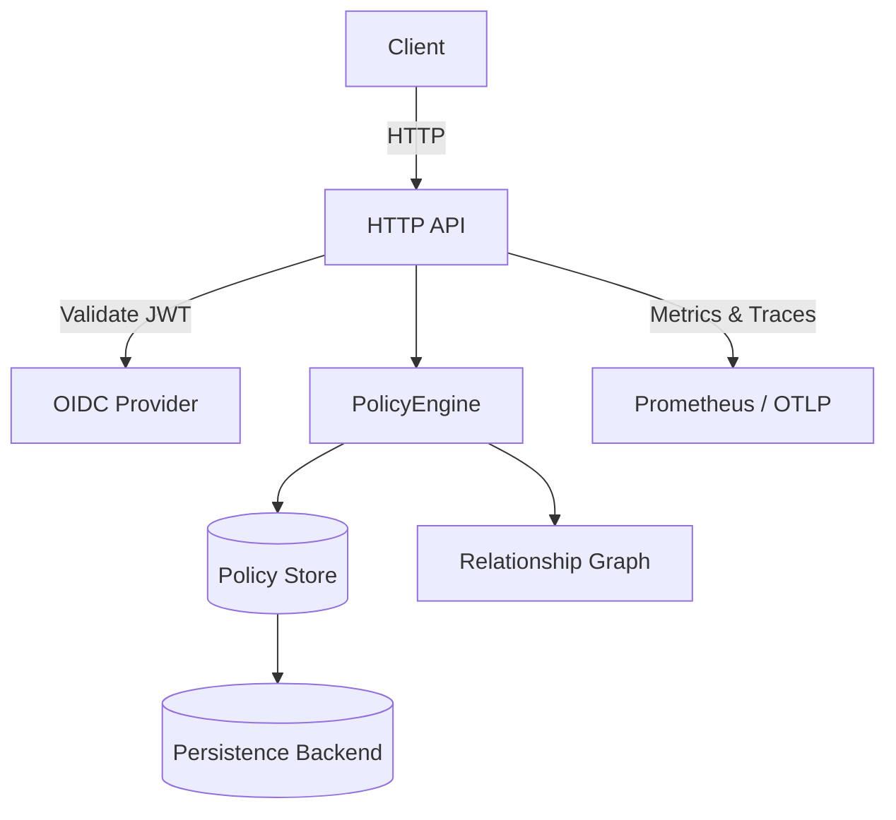

# Architecture

The authorization service is composed of a small set of components that work together to evaluate access decisions.

* **HTTP API** – exposes endpoints for policy management and access checks.
* **OIDC Middleware** – verifies JWTs against configured issuers.
* **Policy Engine** – evaluates CDL policies using a graph of relationships.
* **Policy Store** – caches policies for each tenant and persists them via pluggable backends (memory, SQLite, PostgreSQL).
* **Telemetry** – exports Prometheus metrics and OpenTelemetry traces for observability.
