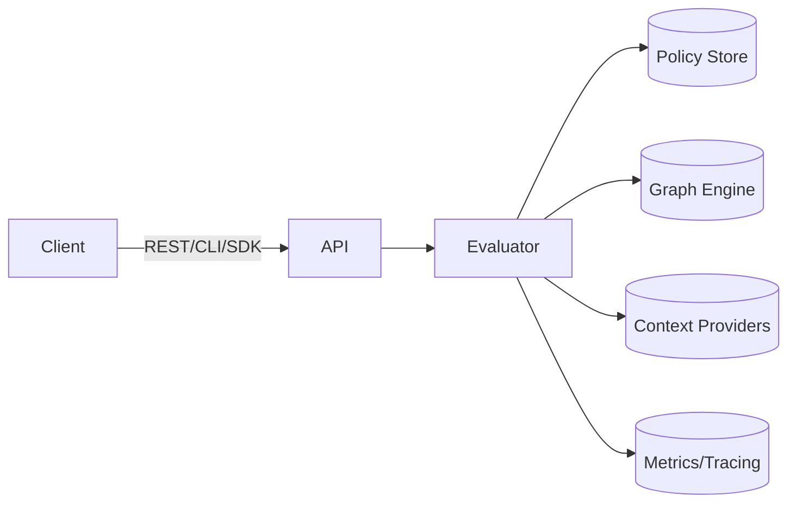

# Architecture

## Overview
The service is composed of a stateless API layer backed by a pluggable policy store and optional context providers. Components communicate over well-defined interfaces to evaluate access requests.



## When to Use
Understand how the system is organized before customizing or deploying it.

## Policy Example
See [examples/rbac.yaml](../examples/rbac.yaml) for a minimal policy used throughout the docs.

## API Usage
Use the REST API to evaluate requests:
```sh
curl -s -X POST http://localhost:8080/check-access \
  -H 'Content-Type: application/json' \
  -d '{"tenantID":"acme","subject":"alice","resource":"file1","action":"read"}'
```

## CLI Usage
```sh
authzctl check-access --tenant acme --subject alice --resource file1 --action read
```

## SDK Usage
Go:
```go
client := authz.NewClient("http://localhost:8080", "token")
client.CheckAccess(ctx, authz.CheckRequest{TenantID: "acme", Subject: "alice", Resource: "file1", Action: "read"})
```
Python:
```python
from authz import Client
client = Client('http://localhost:8080', token='token')
client.check_access(tenant_id='acme', subject='alice', resource='file1', action='read')
```

## Validation/Testing
Run unit tests with `go test ./...` or issue live requests against a running instance.

## Observability
The API exposes Prometheus metrics on `/metrics` and traces via OpenTelemetry.

## Notes & Caveats
This high-level diagram omits internal caches and background workers for brevity.
