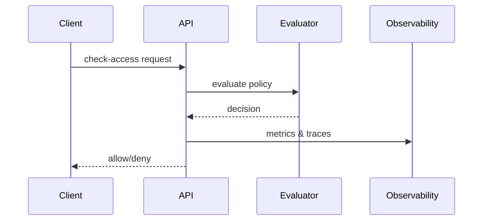

# Flows

## Overview
End-to-end request flows highlight how the service evaluates policies, validates tokens and emits telemetry.



## When to Use
Use these flows to understand integration points and latency.

## Policy Example
See [examples/rbac.yaml](../examples/rbac.yaml).

## API Usage
```sh
curl -s -X POST http://localhost:8080/check-access \
  -H 'Content-Type: application/json' \
  -d '{"tenantID":"acme","subject":"alice","resource":"file1","action":"read"}'
```

## CLI Usage
```sh
authzctl check-access --tenant acme --subject alice --resource file1 --action read
```

## SDK Usage
Go and Python examples mirror those in [architecture.md](architecture.md).

## Validation/Testing
Simulate flows locally using the Postman collection or CLI.

## Observability
Each step emits spans and metrics; view them via your OpenTelemetry backend.

## Notes & Caveats
OIDC validation occurs before evaluation when tokens are provided.
