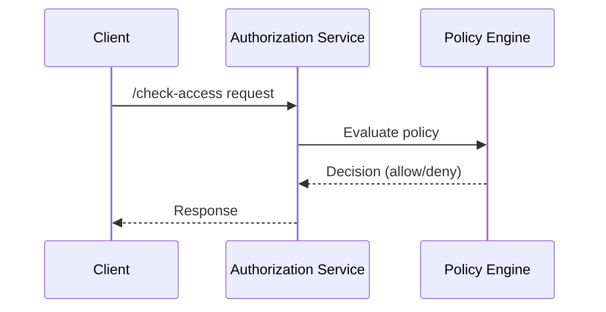
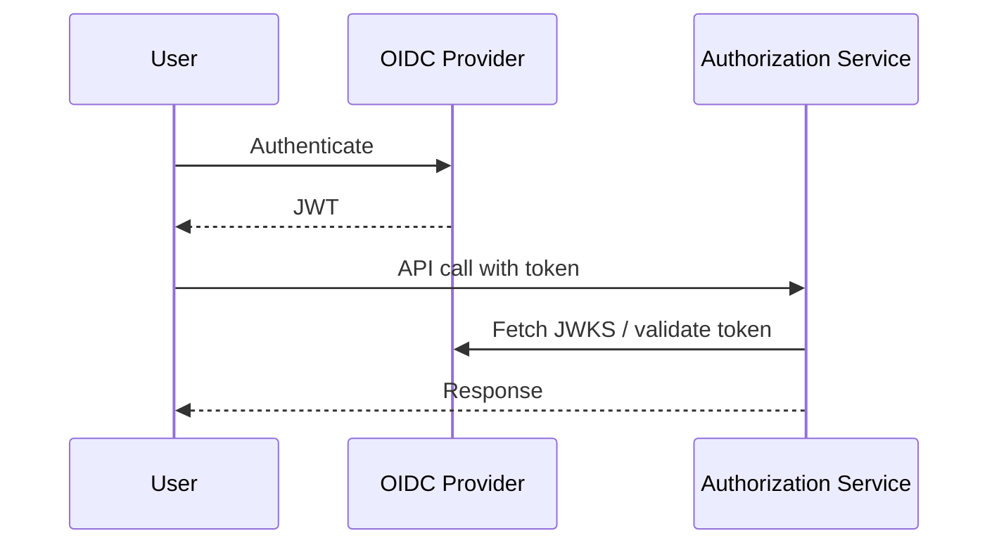
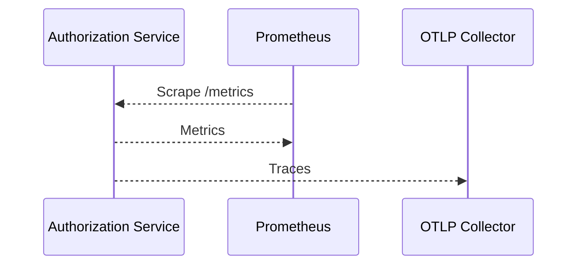

# Flows

## Policy Evaluation

1. Client sends a `check-access` request with a JWT and tenant ID.
2. Service validates the request and forwards it to the policy engine.
3. Policy engine evaluates CDL rules and returns a decision.
4. Service responds to the client with the result.

## OIDC Authentication

The service verifies incoming JWTs against configured issuers using their JWKS endpoints.

## Observability

Metrics are exported in Prometheus format and traces are sent via OTLP to the configured collector.
